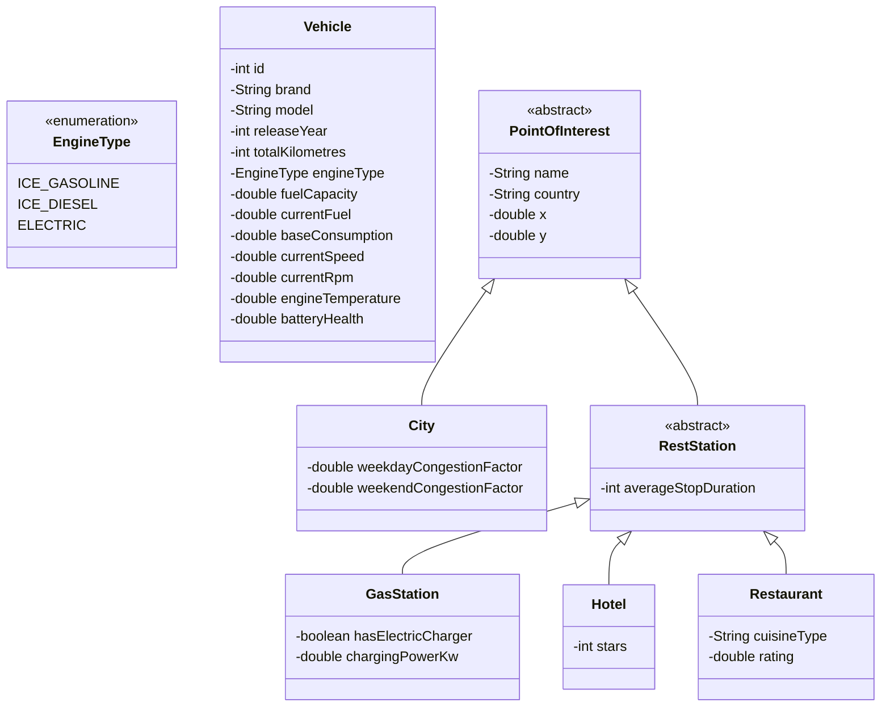

# DigitalDashboardFX
### -------- work in progress -----------------------------------------------------------

## Project Structure
```
.
├── data/                       # JSON Runtime Files
├── src/
│   ├── main/
│   │   ├── java/org/example/
│   │   │   ├── calculations/   # Physics formulas / Graph Algorithms needed for Journey parameter calculation
│   │   │   ├── core/           # Domain Entities and Validators
│   │   │   ├── gui/            # Components and Views - JavaFX
│   │   │   ├── repo/           # Repositories (In-Memory / File Storage)
│   │   │   ├── session/        # Saves all the parameters for the current section
│   │   │   └── utils/          # General Classes for files and string conversion management
│   │   │
│   │   └── resources/          # Static Resources
│   │       ├── animations/     # Media Files (GIF / MP4)
│   │       ├── default_data/   # Test data
│   │       ├── map/            # SVG and PNG map components
│   │       └── style/          # CSS files for the application's theme
│   │
│   └── test/java/org/example/  # Unit tests
└── pom.xml / build.gradle
```
## Domain Model & Class Hierarchy



