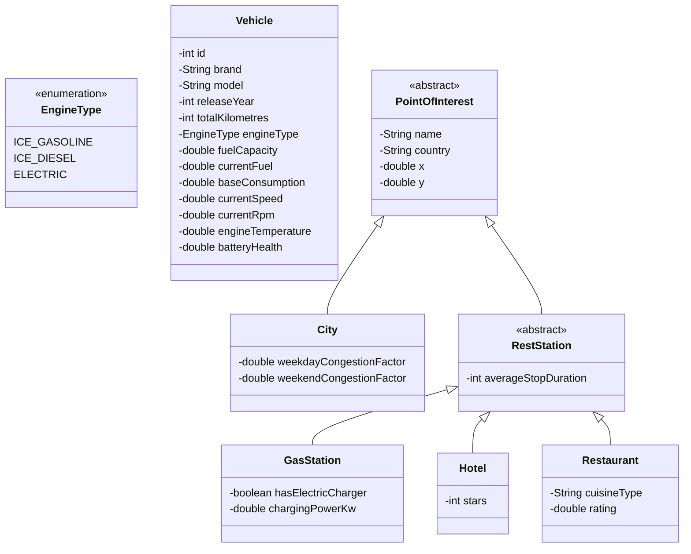

# DigitalDashboardFX
## Geospatial Route Simulation & Telemetry System

A modern, modular **JavaFX Desktop Application** designed to simulate optimal travel routes between real-world cities based on vehicle telemetry, dynamic speed factors, refueling/charging stops, and live traffic conditions.

## 🛠 Tech Stack & Architecture
* **Language**: Java 17
* **GUI Framework**: JavaFX (CSS Styling)
* **Build Tool**: Apache Maven
* **Testing**: JUnit 5
* **Data Storage**: JSON File-based Repositories

## 📍Key Features
### Advanced **Dijkstra** Pathfinding & Constraints
* Custom Dijkstra Algorithm (Dijkstra.java): Calculates optimal routes across a dynamic graph of European Cities, Hotels, Restaurants, and Gas Stations.
* Telemetry & Fuel Constraints: Automatically evaluates fuel/charging thresholds, forcing stops at compatible Gas Stations/Charging Hubs.
* Rest & Hotel Rules: Enforces mandatory driver rest periods (based on daily driving limits) at Hotels or Restaurants.
* Dynamic Graph Connectivity (POI Connectivity Range): Allows users to dynamically adjust the graph distance threshold (maxConnectDistanceKm) to resolve unreachable nodes or isolated graph regions.

### Real-Time Terminal & Simulation Engine
* Non-Blocking Execution: Route calculations and UI log updates run asynchronously via Platform.runLater and delay transitions, keeping the JavaFX UI fluid.
* Interactive Terminal System (TerminalLogService): Custom-styled VBox/ScrollPane featuring real-time event logs (Speed, Rest Stops, Segment Progress) in a neon-cyberpunk visual theme.
* Sequential Animation Manager (RouteAnimationManager): Visualizes vehicle movement across map coordinates (PathTransition), automatically displaying POI pins, labels, and handling "Try Again" recovery workflows.

## Getting Started
### Prerequisites
* Java Development Kit (JDK) 17 or higher
* Apache Maven 3.6+

## Building and Running
1. Clone the repository:
```
git clone https://github.com/alebalatici/DigitalDashboardFX.git
cd DigitalDashboardFX
```
2. Build the project using Maven:
```
mvn clean install
```
3. Run the JavaFX application:
```
mvn javafx:run
```
### -------- work in progress -----------------------------------------------------------
## Project Structure
```
.
├── data/                       # JSON Runtime Files
├── src/
│   ├── main/
│   │   ├── java/org/example/
|   |   |   ├── algorithms/     # Dijkstra, journeyState, PathResult
│   │   │   ├── calculations/   # Graph, Edge, Physics
│   │   │   ├── core/           # Domain Entities and Validators
│   │   │   ├── gui/            # Components and Views - JavaFX
|   |   |   |   ├── components/ # Settings & Simulation View Components
|   |   |   |   ├── utils/      # GUI Utils
|   |   |   |   └── views/      # Primary Views
│   │   │   ├── repo/           # Repositories (In-Memory / File Storage)
│   │   │   ├── session/        # Saves all the parameters for the current section
│   │   │   └── utils/          # General Classes for files and string conversion management
│   │   │
│   │   └── resources/          # Static Resources
│   │       ├── animations/     # Media Files (GIF / MP4)
│   │       ├── default_data/   # Test data
│   │       ├── map/            # SVG and PNG map components
│   │       └── style/          # CSS files for the application's theme
│   │
│   └── test/java/org/example/  # Unit tests
└── pom.xml / build.gradle
```
## Domain Model & Class Hierarchy

```mermaid
classDiagram
    class EngineType {
        <<enumeration>>
        ICE_GASOLINE
        ICE_DIESEL
        ELECTRIC
    }

    class Vehicle {
        -int id
        -String brand
        -String model
        -int releaseYear
        -int totalKilometres
        -EngineType engineType
        -double fuelCapacity
        -double currentFuel
        -double baseConsumption
        -double currentSpeed
        -double currentRpm
        -double engineTemperature
        -double batteryHealth
    }

    class PointOfInterest {
        <<abstract>>
        -String name
        -String country
        -double x
        -double y
    }

    class City {
        -double weekdayCongestionFactor
        -double weekendCongestionFactor
    }

    class RestStation {
        <<abstract>>
        -int averageStopDuration
    }

    class GasStation {
        -boolean hasElectricCharger
        -double chargingPowerKw
    }

    class Hotel {
        -int stars
    }

    class Restaurant {
        -String cuisineType
        -double rating
    }

    PointOfInterest <|-- City
    PointOfInterest <|-- RestStation
    RestStation <|-- GasStation
    RestStation <|-- Hotel
    RestStation <|-- Restaurant
```


